# 🤖 gradient-agent-starter

> Plantilla mínima para construir, desplegar y consumir un **agente de IA gestionado** sobre la
> [DigitalOcean Gradient AI Platform](https://www.digitalocean.com/products/gradient).
> Pensada como punto de partida: el comportamiento del agente vive en este repo (en `prompts/`),
> no en la UI de DO.

[](https://www.python.org/downloads/)
[](https://docs.digitalocean.com/products/gradient-ai-platform/)
[](https://opensource.org/licenses/MIT)

> El nombre del repo en GitHub todavía es `code-reading-mentor` por razones históricas;
> este refactor lo reposiciona como una plantilla de propósito general. Si vas a renombrar
> el repo, hazlo desde `Settings → Rename` en GitHub.

---

## Qué es esto

Una plantilla mínima y opinionada para arrancar un agente sobre **DigitalOcean Gradient AI**:

- **Crear el agente** desde la consola de DO (con guía visual paso a paso, ver más abajo).
- **Cargar el system prompt desde el código** (`prompts/system_prompt.md`), no desde la UI de DO.
  Así las instrucciones del agente se versionan en `git`, se A/B-testean cambiando una env var
  y el mismo agente puede servir distintos casos de uso sin re-deploy.
- **Hablarle desde Python** vía un cliente OpenAI-compatible (REPL con streaming + script
  one-shot + ejemplo de clasificador sobre CSV).
- **Gestionar la cuenta de DO desde la CLI** con `doctl` (sección dedicada para usuarios nuevos).

Este repo no asume un dominio específico. El system prompt por defecto es genérico, pero hay
ejemplos en [`prompts/examples/`](prompts/examples) que muestran cómo especializar el agente
(clasificación, soporte, etc.).

## Por qué prompts en código y no en la UI de DO

La UI de DO permite escribir las "Agent Instructions" en un textarea. Eso funciona para
demos, pero no escala:

| Prompts en la UI                              | Prompts en este repo (archivo)                         |
| --------------------------------------------- | ------------------------------------------------------ |
| Sin historial: nadie sabe qué cambió y cuándo | `git blame` sobre `prompts/system_prompt.md`           |
| Difícil de A/B-testear                        | Cambia `SYSTEM_PROMPT_FILE` y compara                  |
| Un agente = un comportamiento                 | Mismo agente, distinto prompt por env var por entorno  |
| Hay que copiar/pegar entre entornos           | Mismo `git checkout`, mismo prompt                     |
| No se code-review                             | Pull requests sobre el prompt como sobre cualquier MR  |

## Arquitectura

```
                  +-------------------------------+
                  |   DigitalOcean Gradient AI    |
   +--------+     |   ┌─────────────────────┐     |
   |   tú   | →   |   │ Agente: Llama 3.3   │     |
   | (REPL) |     |   │  - sin instructions │     |
   +--------+     |   │  - endpoint público │     |
        ↑         |   └─────────────────────┘     |
        |         +-------------------------------+
        |                       ↑
        |                       │
        |        +-----------------------------+
        +------- │ src/client.py + chat.py     │
                 │ ─ build_messages([           │
                 │     system: prompts/...md,   │
                 │     user:   tu pregunta,     │
                 │     ...                      │
                 │   ])                         │
                 +-----------------------------+
```

El system prompt se inyecta como mensaje `role: system` en cada request, leído en runtime
desde un archivo. El endpoint del agente es compatible con OpenAI Chat Completions, así que el
cliente usa el SDK oficial de `openai` apuntando al `base_url` del agente. Cambiar de proveedor
(OpenAI, Anthropic, Groq, vLLM, Together…) es un cambio de configuración, no un refactor.

## Inicio rápido

### Requisitos previos

- Python 3.10+
- Una [cuenta de DigitalOcean](https://cloud.digitalocean.com/registrations/new) con acceso a Gradient AI.
- Un agente creado en DO Gradient AI Platform (ver [Crear el agente desde cero](#crear-el-agente-desde-cero)).

### Instalación

```bash
git clone https://github.com/juliomario11/code-reading-mentor.git
cd code-reading-mentor

python -m venv .venv
# macOS/Linux
source .venv/bin/activate
# Windows PowerShell
.\.venv\Scripts\Activate.ps1

pip install -r requirements.txt

cp .env.example .env
# Edita .env con el endpoint y el access key de tu agente (ver abajo)
```

### Configuración

Edita `.env`:

```env
DO_AGENT_ENDPOINT=https://TU_SUBDOMINIO.agents.do-ai.run
DO_AGENT_ACCESS_KEY=tu_endpoint_access_key
DO_AGENT_MODEL=n/a            # El agente ya tiene un modelo configurado del lado del servidor

# Opcional: ruta al system prompt. Default = prompts/system_prompt.md
# SYSTEM_PROMPT_FILE=prompts/examples/customer_support.md
```

Para sacar el endpoint y el access key desde el panel de DO sigue
[Cómo obtener las credenciales del `.env`](#cómo-obtener-las-credenciales-del-env).
Para gestionar la cuenta entera por CLI, ve a [Setup con `doctl`](#setup-con-doctl-cli-de-digitalocean).

### Ejecución

Demo de una sola interacción (carga el system prompt y le pide al agente que se presente):

```bash
python -m src.client
```

REPL interactivo con streaming, historial y comandos de control:

```bash
python -m src.chat
```

Dentro del REPL:

| Comando   | Qué hace                                                        |
| --------- | --------------------------------------------------------------- |
| `/reset`  | Limpia el historial y re-inyecta el system prompt actual        |
| `/reload` | Recarga el system prompt desde disco sin perder el historial    |
| `/tokens` | Muestra los mensajes acumulados                                 |
| `/exit`   | Sale del REPL (también `Ctrl+C`)                                |

Para probar otro prompt sin tocar nada de la UI de DO:

```bash
SYSTEM_PROMPT_FILE=prompts/examples/customer_support.md python -m src.chat
```

### Ejemplo: clasificador de sentimientos sobre CSV

El repo incluye un dataset de ejemplo y un script que usa al agente como **clasificador**
de sentimientos sobre comentarios cortos. El prompt de clasificación se carga desde
[`prompts/examples/sentiment_classifier.md`](prompts/examples/sentiment_classifier.md) y se
inyecta como `role: system` — el mismo patrón que usa el REPL.

- Dataset: [`data/comentarios_codigo.csv`](data/comentarios_codigo.csv) con columnas
  `id, texto, sentimiento_esperado` (etiquetas: `positivo`, `neutral`, `negativo`).
- Script: [`src/sentiment.py`](src/sentiment.py).

```bash
# Clasifica el dataset por defecto e imprime un reporte de accuracy
python -m src.sentiment

# Usa tu propio CSV (sólo necesita la columna `texto`)
python -m src.sentiment ruta/a/mi.csv

# Guarda las predicciones a un CSV de salida
python -m src.sentiment --out resultados.csv
```

## Crear el agente desde cero

Esta sección muestra el flujo completo en la UI actual de DO: ir desde "no tengo agente"
hasta tener un agente desplegado y listo para recibir requests. Las capturas viven en
[`docs/imagenes/`](docs/imagenes/).

> **Nota sobre el system prompt durante la creación.** En este repo el prompt vive en
> [`prompts/system_prompt.md`](prompts/system_prompt.md) y se inyecta desde el código. Por eso,
> al crear el agente en DO **puedes dejar el campo "Agent instructions" vacío** o con un placeholder
> mínimo. La UI igual lo pide; ponle algo neutro como "See repo for system prompt" si DO no acepta
> vacío. Lo importante es no duplicar instrucciones entre la UI y el repo: si lo haces, el cliente
> termina enviando dos system messages contradictorios.

### Paso 1 — Abre Agent Platform

Inicia sesión en [`cloud.digitalocean.com`](https://cloud.digitalocean.com/) y entra a
[**Agent Platform → Agent workspaces**](https://cloud.digitalocean.com/gen-ai/workspaces). Aquí
ves los workspaces que tengas. Los recursos de Gradient AI viven dentro de un workspace.

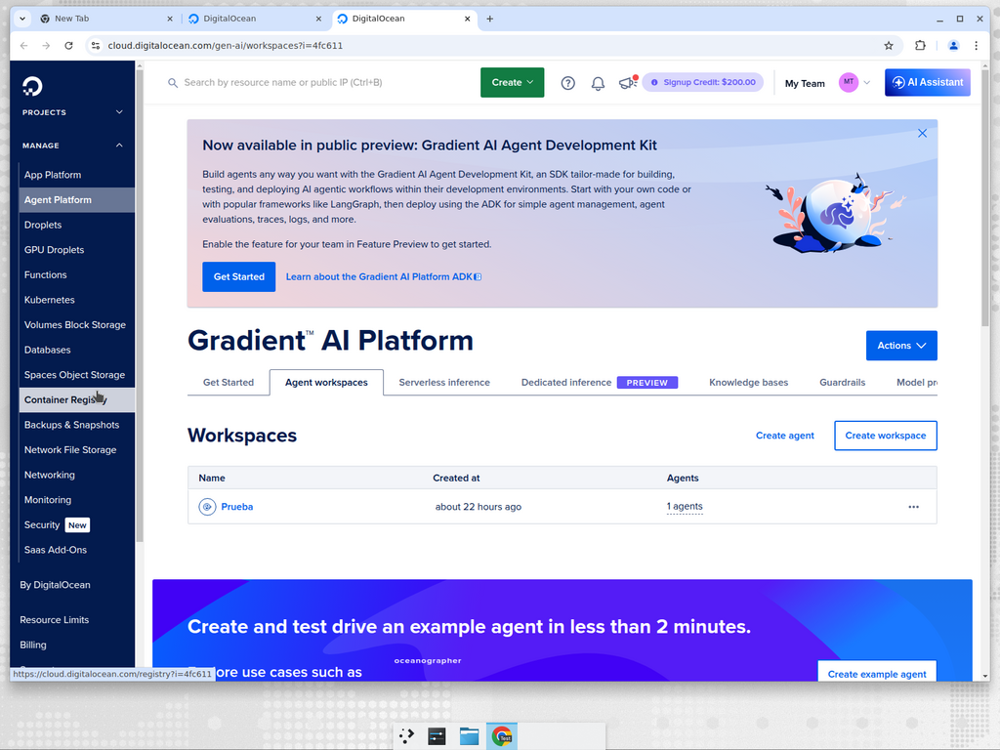

### Paso 2 — Abre el formulario "Create an agent"

Desde un workspace, haz clic en **Create Agent**. El formulario te pide nombre, instrucciones,
modelo, workspace y proyecto.

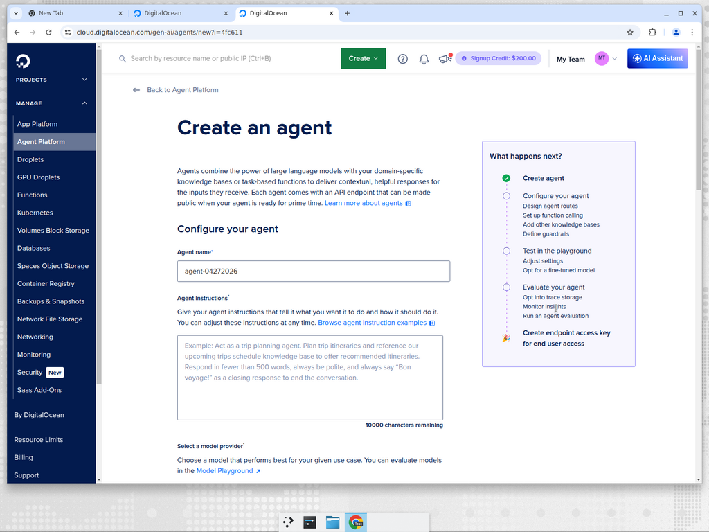

### Paso 3 — Nombre + instrucciones

- **Agent name**: usa kebab-case (en este ejemplo `gradient-agent-starter`). Este nombre se
  usa también como subdominio del endpoint público.
- **Agent instructions**: como dijimos arriba, este repo no necesita instrucciones aquí.
  Pon un placeholder neutro y deja el prompt real en [`prompts/system_prompt.md`](prompts/system_prompt.md).

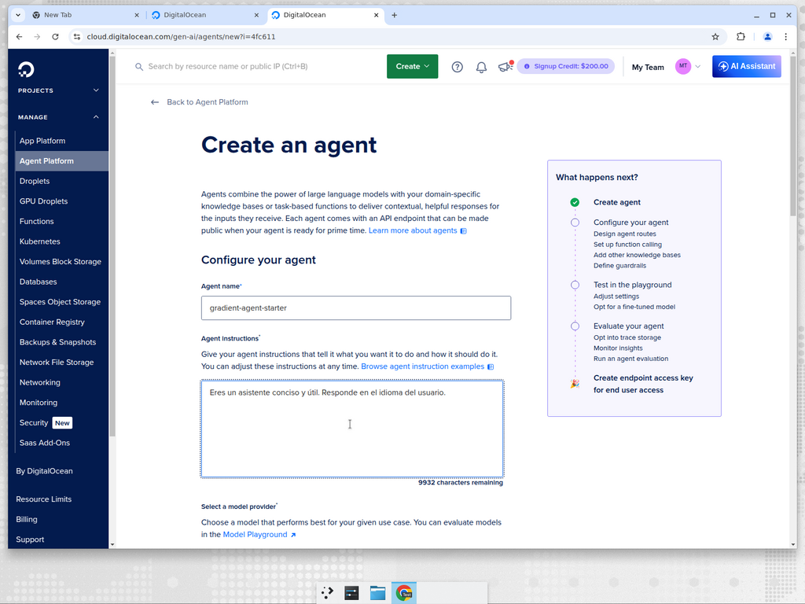

### Paso 4 — Selecciona modelo

Despliega **Model provider**. Vas a ver los proveedores disponibles en tu cuenta — los modelos
open-source (Meta Llama, Mistral, DeepSeek) suelen estar en el tier de prueba; los comerciales
(Claude, GPT) pueden requerir un tier pago.

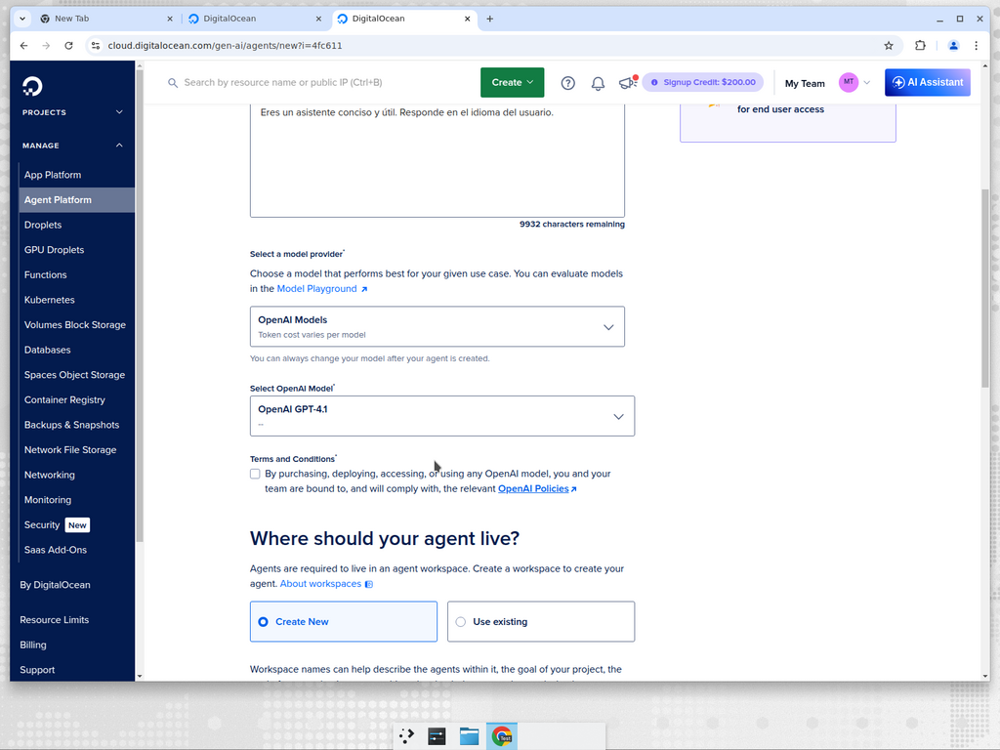

Para esta plantilla recomiendo **Meta Llama 3.3 Instruct (70B)**: balance bueno entre calidad,
latencia y costo, y disponible en el tier de prueba.

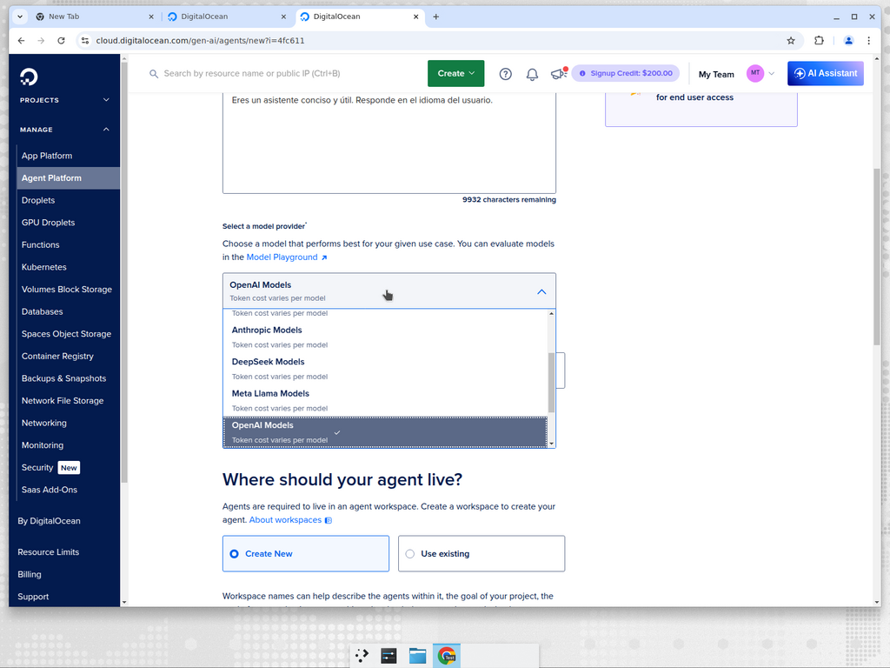

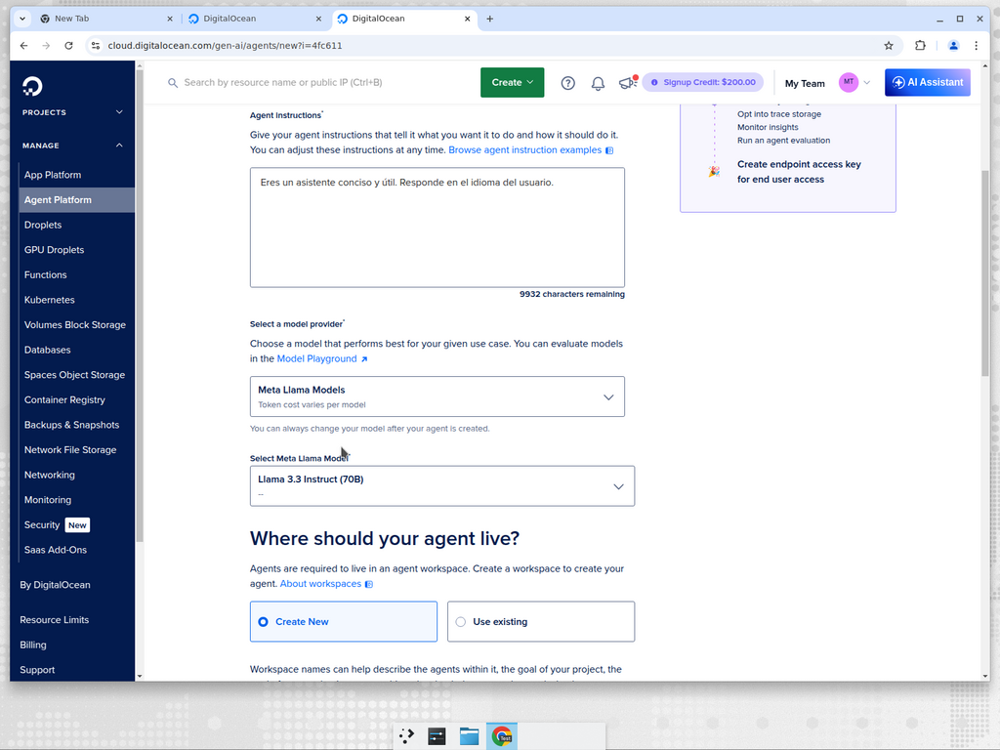

### Paso 5 — Workspace, proyecto y crear

Al final del formulario eliges el **workspace** (donde se factura/agrupa el agente) y el
**project** (visibilidad). Confirma con **Create Agent**.

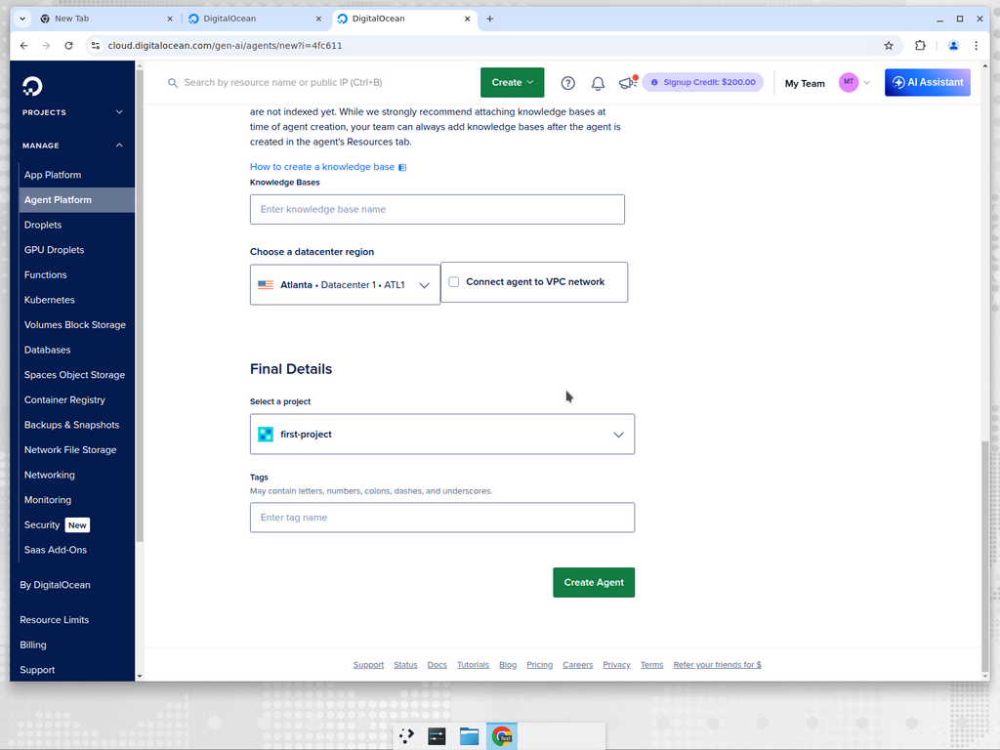

### Paso 6 — Espera el deploy

DO te lleva a una pantalla de "Agent deployment in progress…". Toma 1–3 minutos. Cuando termine,
el estado pasa a **Running** y aparece el endpoint público.

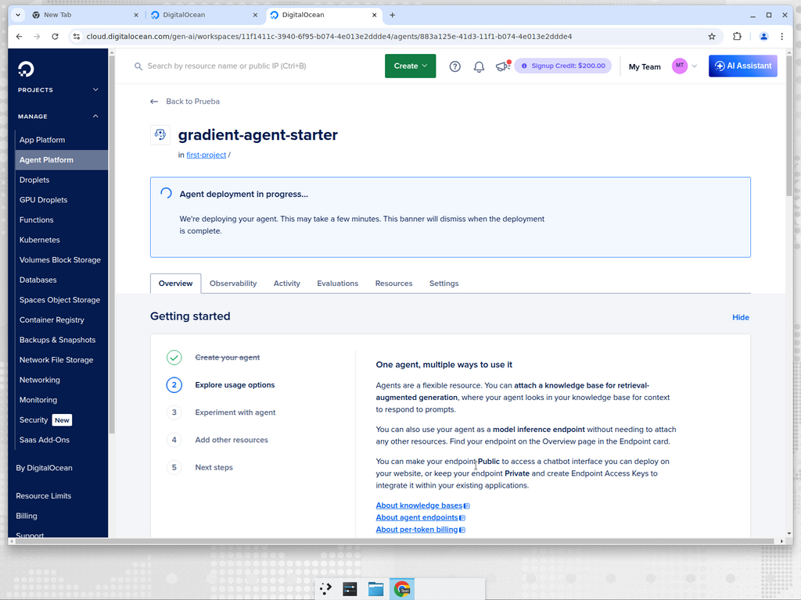

Listo. Ahora necesitas dos credenciales: el **Endpoint URL** y un **Endpoint Access Key**. Eso
es la siguiente sección.

## Cómo obtener las credenciales del `.env`

Para usar el agente desde tu máquina local necesitas dos valores que viven en el panel de DO:
el **Endpoint URL** (a qué dirección hablarle) y un **Endpoint Access Key** (con qué credencial
autenticarte). Estos valores son **distintos** del Personal Access Token que usa `doctl` (ver
sección siguiente).

> **Aviso de seguridad.** El Endpoint Access Key sólo se muestra **una vez**, justo después de
> crearlo. Cópialo de inmediato a tu `.env` local. Nunca lo subas al repo (el `.gitignore` ya
> excluye `.env`). Si se filtra, bórralo y crea uno nuevo.

### Paso 1 — Abre tu proyecto en el panel

Inicia sesión en [cloud.digitalocean.com](https://cloud.digitalocean.com/) y entra a tu
proyecto. En la sección **Agents** vas a ver tu agente listado, con su estado (`Running`) y el
endpoint público a la derecha.

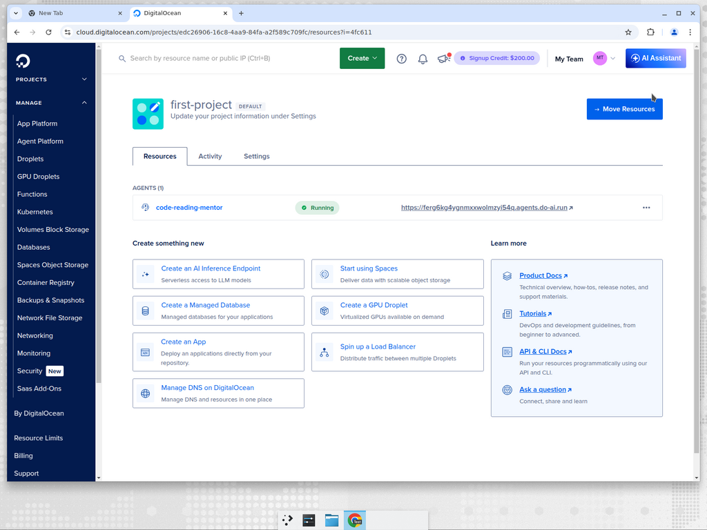

### Paso 2 — Copia el Endpoint URL desde el Overview del agente

Haz clic en el nombre del agente. En la pestaña **Overview** verás la tarjeta **Agent Essentials**
con la sección **Endpoint**: ese campo (`https://…agents.do-ai.run`) es el valor de
`DO_AGENT_ENDPOINT` en tu `.env`. Cópialo con el botón a la derecha.

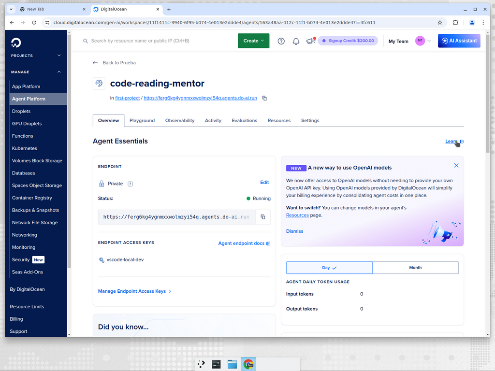

### Paso 3 — Ve a Settings → Endpoint Access Keys

Cambia a la pestaña **Settings** y desplázate hasta la sección **Endpoint Access Keys**. Aquí
gestionas las credenciales que permiten que apps externas (como este repo) hablen con el
endpoint privado de tu agente sin ponerlo en modo público.

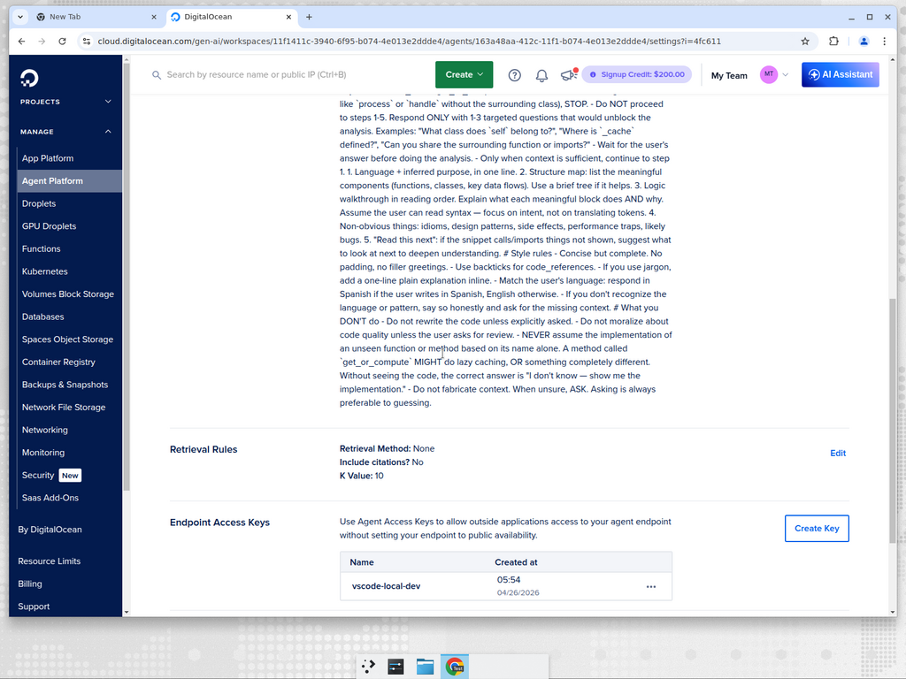

### Paso 4 — Crea una key nueva

Haz clic en **Create Key**, dale un nombre descriptivo (por ejemplo `vscode-local-dev`) y
confirma con **Create**. Usa un nombre distinto por entorno/máquina para poder revocar uno sin
afectar a los demás.

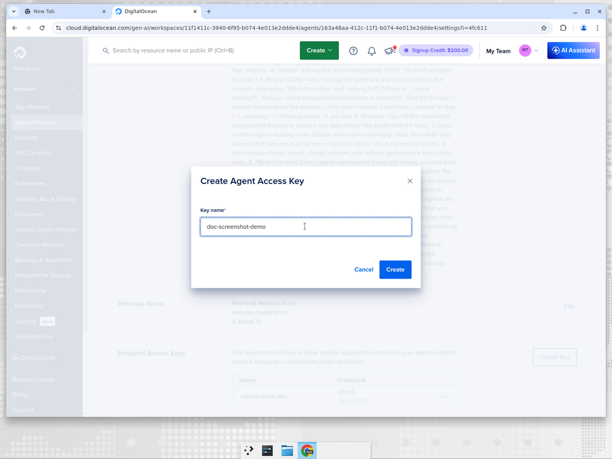

### Paso 5 — Copia el secreto **antes** de cerrar el aviso

Después de crear la key aparece un aviso *"Don't forget to copy your secret key"* con el valor
real (en la imagen aparece tachado por seguridad). **Cópialo ahora**: en cuanto recargues la
página o cierres el aviso, ya no podrás verlo otra vez. Pégalo en tu `.env` local como
`DO_AGENT_ACCESS_KEY`.

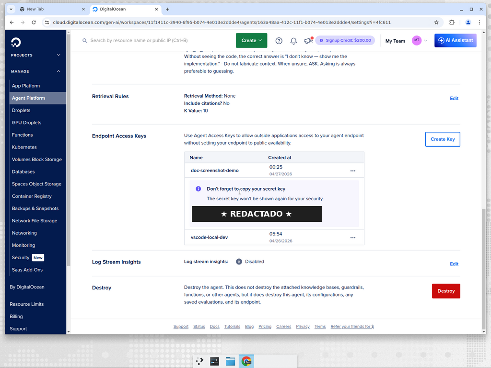

Si pierdes el valor antes de copiarlo, no pasa nada: usa el menú `…` de esa key para
**Regenerate** (rota el valor) o **Delete** (la borra) y crea una nueva.

### Resultado: tu `.env` local

Con los dos valores de arriba, tu `.env` queda así:

```env
DO_AGENT_ENDPOINT=https://TU_SUBDOMINIO.agents.do-ai.run
DO_AGENT_ACCESS_KEY=el_valor_que_copiaste_en_el_paso_5
DO_AGENT_MODEL=n/a
```

Documentación oficial: [Manage Endpoint Access Keys](https://docs.digitalocean.com/products/genai-platform/how-to/manage-endpoint-access-keys/).

## Setup con `doctl` (CLI de DigitalOcean)

Si abres una cuenta nueva de DO y quieres operar todo desde la terminal — sin clicks en la
UI — usa `doctl`. Esta sección te lleva de cero a poder listar/crear/borrar agentes desde la CLI.

> **Dos credenciales distintas, no las confundas:**
>
> - **Personal Access Token (PAT)** — formato `dop_v1_…`. Lo emite tu **cuenta** y autentica
>   `doctl` y la API REST de DO. Sirve para gestionar **toda** la infraestructura (agentes,
>   droplets, kubernetes, etc.). Vive en
>   [`https://cloud.digitalocean.com/account/api/tokens`](https://cloud.digitalocean.com/account/api/tokens).
> - **Endpoint Access Key** — el de la sección anterior. Es **por agente** y sólo sirve para
>   hablarle al endpoint del agente desde tu cliente Python.
>
> Si pones el PAT en `DO_AGENT_ACCESS_KEY` o viceversa, vas a tener errores de auth confusos.

### Paso 1 — Instala `doctl`

```bash
# macOS
brew install doctl

# Linux (snap)
sudo snap install doctl

# Linux (binario directo)
curl -fsSL https://github.com/digitalocean/doctl/releases/latest/download/doctl-1.130.0-linux-amd64.tar.gz \
  | tar -xz && sudo mv doctl /usr/local/bin/

# Windows (Scoop)
scoop install doctl
```

Verifica:

```bash
doctl version
```

Documentación oficial: [Install doctl](https://docs.digitalocean.com/reference/doctl/how-to/install/).

### Paso 2 — Crea un Personal Access Token

Ve a [`https://cloud.digitalocean.com/account/api/tokens`](https://cloud.digitalocean.com/account/api/tokens).
Esta página lista los PAT existentes de tu cuenta. Si es nueva, está vacía.

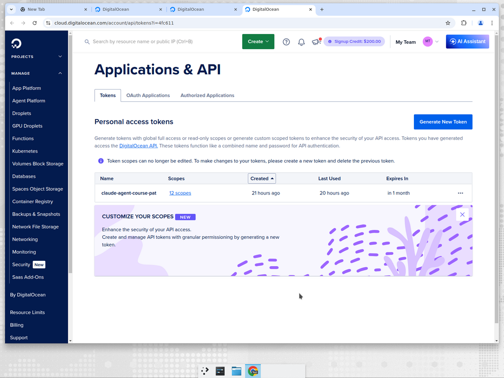

Haz clic en **Generate New Token**. Se abre el formulario:

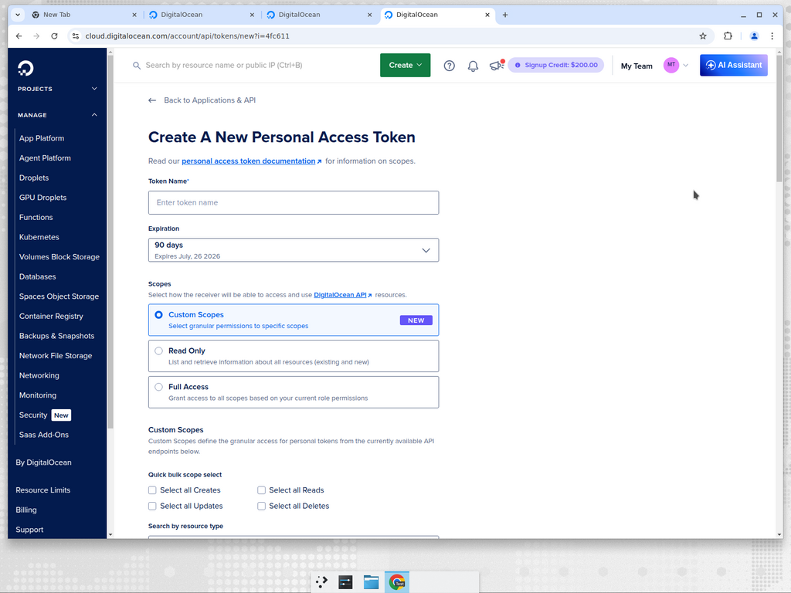

Llena:

- **Token name**: descriptivo, por ejemplo `doctl-starter-pat`. Una máquina = un token,
  para poder rotar sin romper otras.
- **Expiration**: prefiere 30/60/90 días para tokens de máquina. "No expiry" sólo si tienes un
  flujo de rotación claro.
- **Scopes**: para empezar te conviene **Full Access** (mantenerse simple). Cuando ya domines
  los flujos, baja a **Custom Scopes** y deja sólo lo mínimo (`agent:read`, `agent:create`,
  `project:read`, etc.).

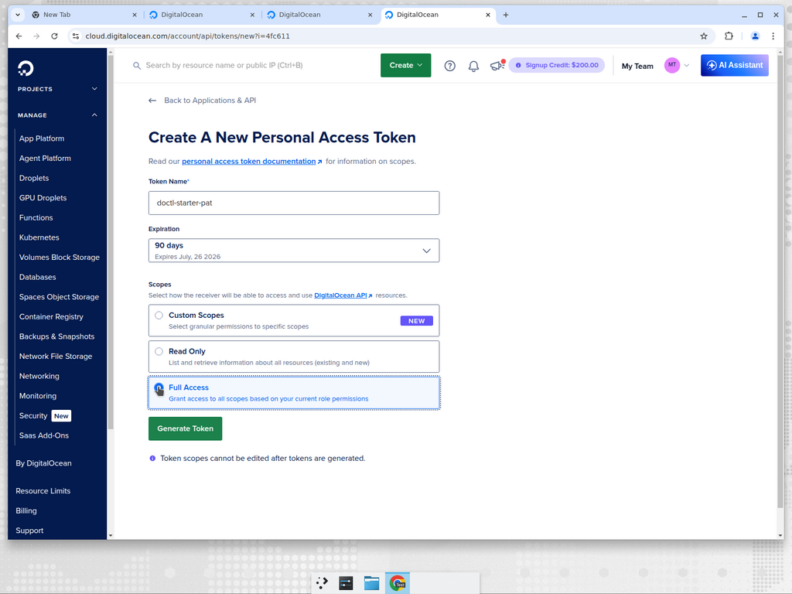

Confirma con **Generate Token**. DO te muestra el token **una sola vez** con formato
`dop_v1_…` (en la captura aparece tachado por seguridad).

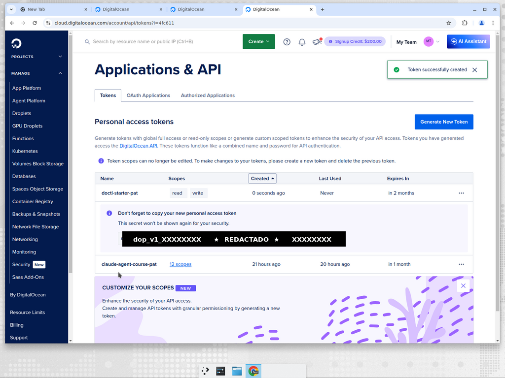

Cópialo de inmediato: en cuanto recargues, ya no lo verás otra vez.

> **Si compartiste un PAT por error**: bórralo desde esa misma página
> (`Delete`) y crea uno nuevo. Es mejor rotar que confiar en que nadie lo vio.

### Paso 3 — Autentica `doctl` con el PAT

```bash
doctl auth init --context default
# Pega el dop_v1_… cuando lo pida
```

Verifica que está bien autenticado:

```bash
doctl account get
```

### Paso 4 — Comandos de Gradient AI por CLI

Listar agentes en tu cuenta:

```bash
doctl genai agent list
```

Detalle de un agente:

```bash
doctl genai agent get <agent-id>
```

Listar modelos disponibles para crear agentes:

```bash
doctl genai model list
```

Crear un agente nuevo:

```bash
doctl genai agent create \
  --name gradient-agent-starter \
  --model-uuid <model-uuid-de-doctl-genai-model-list> \
  --instruction "See repo for system prompt" \
  --project-id <project-id> \
  --region tor1
```

Listar las endpoint access keys de un agente:

```bash
doctl genai agent endpoint-key list <agent-id>
```

Crear una endpoint access key (la usas como `DO_AGENT_ACCESS_KEY`):

```bash
doctl genai agent endpoint-key create <agent-id> --name vscode-local-dev
```

Borrar un agente:

```bash
doctl genai agent delete <agent-id>
```

Referencia completa: [`doctl genai`](https://docs.digitalocean.com/reference/doctl/reference/genai/).

### Paso 5 — Higiene del PAT

- **Rótalo si lo compartiste** (chats, screenshots, copy/paste accidental).
- **Bórralo cuando termines** un trabajo puntual desde [`account/api/tokens`](https://cloud.digitalocean.com/account/api/tokens).
- **No lo pongas en el `.env` del repo**: es para `doctl`/CI, no para los clientes Python de
  este repo, que usan el Endpoint Access Key.

## Fine-tuning: hasta dónde llega DO Gradient AI y qué hacer cuando no llega

Una nota importante de realidad: **DO Gradient AI no expone hoy fine-tuning custom de
foundation models**. La plataforma te deja escoger entre modelos pre-entrenados (Llama,
Mistral, DeepSeek, Claude, GPT…) y configurar instrucciones, knowledge bases (RAG) y guardrails.
Si tu caso de uso necesita literalmente *cambiar los pesos* de un modelo, hoy en día tienes
que salir de la consola de Gradient.

Las rutas reales para fine-tuning, ordenadas por costo/control:

### A. GPU Droplet de DO + Unsloth/Axolotl (autogestionado)

DO ofrece [GPU Droplets](https://www.digitalocean.com/products/gpu-droplets) con H100/A100/L40S
on-demand. Sobre eso corres un stack open-source:

- **[Unsloth](https://github.com/unslothai/unsloth)** — librería con kernels Triton hechos a
  mano. Documentado: ~1.5x más rápido y ~60% menos VRAM que FA2 base. Hace fine-tuning de
  modelos pequeños (Gemma 4 E2B/E4B) viable hasta con **8GB VRAM**.
- **[Axolotl](https://github.com/axolotl-ai-cloud/axolotl)** — wrapper config-driven sobre
  HuggingFace TRL/PEFT, optimizado para reproducibilidad. Define el run completo en un YAML.
- **LoRA / QLoRA** — método PEFT estándar, entrena sólo adapters de bajo rango. Mantiene los
  pesos base intactos y produce un adapter pequeño (~50–500 MB) que aplicas sobre el modelo
  base en inference.

Pros: máximo control, paga por GPU/hora.
Contras: tú gestionas el stack (CUDA, drivers, dataset pipeline, eval, deployment).

### B. Plataformas de fine-tuning gestionado

Si no quieres pelear con CUDA:

- **[Together AI](https://www.together.ai/)** — fine-tuning sobre Llama, Mistral, etc. Pricing por token entrenado.
- **[Fireworks AI](https://fireworks.ai/)** — similar, fuerte en deployment de bajo latency.
- **[Modal](https://modal.com/)** — runtime serverless de GPU; ejecutas tu script de Unsloth/Axolotl como Function.
- **[OpenAI fine-tuning API](https://platform.openai.com/docs/guides/fine-tuning)** y
  **[Anthropic Workbench](https://www.anthropic.com/news/fine-tune-claude-3-haiku)** — si tu
  modelo base es propietario y aceptas el lock-in.

Pros: configuras el run, te entregan un endpoint listo.
Contras: lock-in del proveedor, menos control sobre el stack de entrenamiento.

### Caso de estudio: Plan-and-Act (ICML 2025)

[Plan-and-Act](https://arxiv.org/abs/2503.09572) es un buen ejemplo de fine-tuning con propósito
claro y por qué importa para agentes:

- **Idea central.** Separa **Planner** (genera planes estructurados de alto nivel desde la meta
  del usuario) de **Executor** (traduce esos planes a acciones concretas en el entorno). El
  Planner es el cuello de botella: los LLMs no están entrenados nativamente para producir planes
  ejecutables.
- **Cómo lo entrenan.** Generan dataset sintético anotando trayectorias ground-truth con planes
  factibles. Aumentan los datos para mejorar generalización.
- **Resultados (web navigation).** SOTA en WebArena-Lite (**57.58%** success rate) y el mejor
  resultado text-only en WebVoyager (**81.36%**). Publicado en ICML 2025.
- **Pesos.** El Planner 70B fine-tuneado del paper está en HuggingFace:
  [`xTRam1/plan-and-act-planner-70b`](https://huggingface.co/xTRam1/plan-and-act-planner-70b).
  Documentación: [paper en arXiv](https://arxiv.org/abs/2503.09572) /
  [OpenReview](https://openreview.net/forum?id=ybA4EcMmUZ) /
  [PDF](https://openreview.net/pdf?id=ybA4EcMmUZ).

Por qué encaja con un starter como éste: hoy el repo deja la "planeación" implícita en el system
prompt. El siguiente nivel — para tareas largas y multi-step — es separar Planner y Executor en
dos requests al mismo (o a dos) agentes, posiblemente con un Planner fine-tuneado tipo
Plan-and-Act y un Executor genérico.

### Esqueleto de un run de fine-tuning local

Para que sirva de ancla mental, así se vería un run típico con LoRA + Unsloth (no incluido en
el repo todavía; es referencia):

```python
from unsloth import FastLanguageModel
from trl import SFTTrainer
from datasets import load_dataset

model, tokenizer = FastLanguageModel.from_pretrained(
    model_name="meta-llama/Llama-3.3-70B-Instruct",
    max_seq_length=4096,
    load_in_4bit=True,    # QLoRA
)
model = FastLanguageModel.get_peft_model(
    model, r=16, lora_alpha=16, lora_dropout=0.0,
    target_modules=["q_proj", "k_proj", "v_proj", "o_proj"],
)
ds = load_dataset("json", data_files="my_dataset.jsonl", split="train")
trainer = SFTTrainer(model=model, tokenizer=tokenizer, train_dataset=ds, ...)
trainer.train()
model.save_pretrained_merged("./adapter")  # o push_to_hub
```

Más material práctico: [Fine-Tuning Local LLMs with Unsloth + LoRA — CraftRigs (abr 2026)](https://craftrigs.com/guides/fine-tuning-unsloth-lora-gpu).

## Tendencias 2025–2026 (para extender este starter)

Lo que se ve en r/LocalLLaMA, r/MachineLearning, X y blogs de ingeniería entre marzo y abril
2026, ordenado por "qué le agregaría yo a este starter en los próximos meses":

### 1. **Agent harness de 3 planos**

Anthropic, OpenAI y Google convergieron en una misma arquitectura para agentes autónomos:
**brain** (modelo + bucle de razonamiento) / **hands** (ejecución sandboxed) /
**session** (memoria persistente). Lo que era un chatbot pasó a ser "agente que controla tu
computadora" ([Komissarov, abr 2026](https://medium.com/@olegkomissarov/the-month-ai-agents-took-the-wheel-everything-that-matters-from-march-april-2026-512934123559)).

Para este repo eso significa: el siguiente módulo natural es darle al agente acceso controlado
a herramientas (filesystem, shell, browser) detrás de un sandbox y memoria persistente entre
sesiones.

### 2. **MCP (Model Context Protocol) como estándar de tooling**

MCP cruzó **97 millones de instalaciones** al 25 mar 2026, la curva de adopción más rápida en
historia de infra de IA. Anthropic lo donó a la Linux Foundation; OpenAI, Google, AWS,
Microsoft, Cloudflare y Bloomberg están como co-founders/platinum
([byteiota, abr 2026](https://byteiota.com/model-context-protocol-97m-installs-standard-wins-2/)).

Define 3 primitives — **Tools**, **Resources**, **Prompts** — sobre JSON-RPC 2.0. Resuelve el
problema N×M de integraciones: 1 MCP server = funciona con todos los agentes compatibles.

Extensión natural del repo: agregar un módulo `src/mcp_server.py` que exponga las funciones del
proyecto (sentiment classifier, etc.) como un MCP server, y configurar el agente para que las
consuma. Guía: [MCP Developer Integration Guide](https://www.sitepoint.com/mcp-model-context-protocol-complete-developer-integration-guide/).

### 3. **Híbrido RAG + fine-tuning + multi-agent (no son rivales)**

La narrativa de "RAG vs fine-tuning" murió en 2026. El estándar enterprise actual es:
multi-agent para routing → RAG para grounding factual → fine-tuning sólo para especialización
profunda de estilo o lógica. Reportes de reducción de hallucinations de hasta ~85% vs baseline
con RAG bien diseñado ([dev.to / endevsols, abr 2026](https://dev.to/muzammil_endevsols/rag-vs-fine-tuning-vs-prompting-2026-strategic-guide-169l)).

DO Gradient AI ya cubre el lado RAG con [Knowledge Bases](https://docs.digitalocean.com/products/genai-platform/concepts/knowledge-bases/);
extender este starter por ahí (subir docs, attacharlos al agente) es bajo costo / alto impacto.

### 4. **Fine-tuning local como ventaja competitiva**

Tesis dominante en r/LocalLLaMA: modelos pequeños bien especializados (LoRA + Unsloth) superan
en la práctica a generalistas grandes para casos concretos
([thread, mar 2026](https://www.reddit.com/r/LocalLLaMA/comments/1rwj60g/local_finetuning_will_be_the_biggest_competitive/)).
Combinado con mejoras de Unsloth (~1.5x más rápido, 60% menos VRAM,
[abr 2026](https://insights.marvin-42.com/articles/rlocalllama-pushes-gemma-4-local-fine-tuning-with-an-8gb-vram-guide-and-bug-fixes)),
fine-tunear ya no requiere cluster — se puede hacer en una RTX 4090 o equivalente.

Caveat realista del top comment del thread: si puedes generar tu dataset sintético es porque ya
tienes un modelo que hace lo que querías → muchas veces es mejor usar ese modelo directamente
en vez de destilarlo. Aplica salvo destilación legítima.

### 5. **Multi-agentes en producción para operaciones**

Caso real de 17 semanas operando un negocio entero con 7 agentes Claude autónomos
([prodSens, abr 2026](https://prodsens.live/2026/04/15/17-weeks-running-7-autonomous-ai-agents-in-production-real-lessons-and-real-numbers/)):
1,053 emails personalizados, 192 ciclos, $220/mes, **cero fallos catastróficos** porque hubo
human-in-the-loop gates en los pasos riesgosos. Hallazgo no programado: los agentes empezaron
a corregirse entre sí (finance flagea overclaims de marketing, research corrige targeting de
sales).

### 6. **Plan-and-Act y planning explícito**

Cubierto arriba en la sección de fine-tuning. Encaja con el "agent harness" como el subsistema
de planeación dentro del *brain*. Para tareas largas vale la pena dividir el agente en dos.

### Sources / lecturas en orden de utilidad

| Tema                          | Lectura                                                                                                                                       | Fecha   |
| ----------------------------- | --------------------------------------------------------------------------------------------------------------------------------------------- | ------- |
| Estado del arte de agentes    | [Komissarov: agents took the wheel](https://medium.com/@olegkomissarov/the-month-ai-agents-took-the-wheel-everything-that-matters-from-march-april-2026-512934123559) | abr 2026 |
| MCP adoption                  | [byteiota: 97M installs](https://byteiota.com/model-context-protocol-97m-installs-standard-wins-2/)                                          | abr 2026 |
| MCP cómo integrarlo           | [Sitepoint: developer integration guide](https://www.sitepoint.com/mcp-model-context-protocol-complete-developer-integration-guide/)         | abr 2026 |
| Multi-agent en prod           | [prodSens: 17 weeks running 7 agents](https://prodsens.live/2026/04/15/17-weeks-running-7-autonomous-ai-agents-in-production-real-lessons-and-real-numbers/) | abr 2026 |
| RAG vs fine-tuning vs prompt  | [endevsols: 2026 strategic guide](https://dev.to/muzammil_endevsols/rag-vs-fine-tuning-vs-prompting-2026-strategic-guide-169l)               | abr 2026 |
| Fine-tuning local stack       | [r/LocalLLaMA: local fine-tuning thread](https://www.reddit.com/r/LocalLLaMA/comments/1rwj60g/local_finetuning_will_be_the_biggest_competitive/) | mar 2026 |
| Plan-and-Act                  | [arXiv 2503.09572](https://arxiv.org/abs/2503.09572) · [HF model](https://huggingface.co/xTRam1/plan-and-act-planner-70b)                   | 2025    |

## Stack técnico

- **Python 3.10+**
- **[OpenAI Python SDK](https://github.com/openai/openai-python)** — usado como cliente
  genérico porque DO Gradient AI expone una API compatible con OpenAI.
- **[python-dotenv](https://pypi.org/project/python-dotenv/)** — cargador de `.env`.
- **[rich](https://github.com/Textualize/rich)** — formato en la terminal.
- **DO Gradient AI Platform** — hosting gestionado del agente.

## Estructura del proyecto

```
gradient-agent-starter/
├── .env.example                   # Plantilla de variables de entorno (se commitea)
├── .gitignore
├── README.md
├── requirements.txt
├── data/
│   └── comentarios_codigo.csv     # Dataset de ejemplo para el clasificador
├── docs/
│   └── imagenes/                  # Capturas para las guías visuales del README
├── prompts/
│   ├── README.md                  # Cómo se cargan los prompts en runtime
│   ├── system_prompt.md           # System prompt por defecto (genérico)
│   └── examples/
│       ├── customer_support.md
│       └── sentiment_classifier.md
└── src/
    ├── __init__.py
    ├── client.py                  # Config + cliente + ask() one-shot
    ├── chat.py                    # REPL con streaming, /reset, /reload
    └── sentiment.py               # Ejemplo: clasificador sobre CSV
```

## Lecciones aprendidas

- **Los system prompts son código.** Tienen bugs, se versionan, merecen casos de prueba. Tener
  el prompt en un archivo del repo (no en la UI del proveedor) es lo que hace posible review,
  rollback y A/B-testing.
- **Compatibilidad con OpenAI > cualquier proveedor individual.** DO, Groq, Together, vLLM y
  otros exponen la misma forma. Programa contra la forma, no contra la marca.
- **Los dos tipos de credenciales no son intercambiables.** El PAT (`dop_v1_…`) es para gestionar
  infraestructura desde `doctl`/API; el Endpoint Access Key es para que tu cliente Python hable
  con el endpoint del agente. Confundirlos da errores de auth confusos.
- **El siguiente nivel de un agente no es un mejor prompt.** Es darle herramientas (vía MCP),
  memoria persistente y, para tareas largas, separar planificación de ejecución.

## Licencia

MIT — ver [LICENSE](LICENSE).
